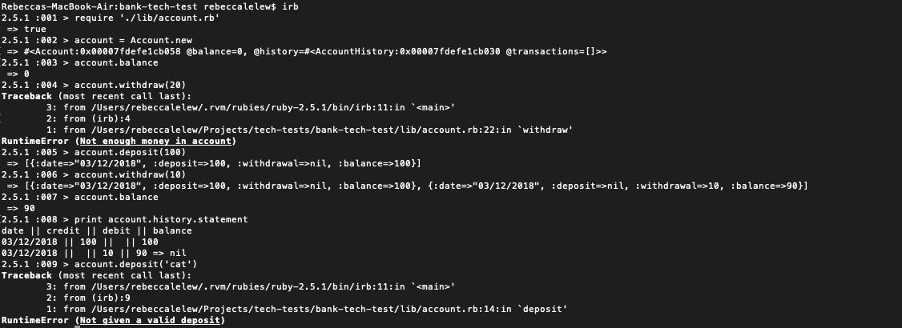

## Bank Tech test

This is a simple programme, written in ruby, to simulate a bank account.

The programme contains two classes - an Account class for keeping track of balance, including withdrawals and deposits; and an Account History class which keeps a log of all successful past transactions, and can return a statement.

In writing it, I have used principles of object-oriented design. Methods and classes are as small as possible and obey the single responsibility principle, and I have aimed for good readability so that my code is as easy to work on and change as possible.

The programme is run from the command line. See the section below on 'working on and running the code for instructions on how to use it.

The programme is tested with both unit tests and feature tests, using RSpec - a testing framework for Ruby. Test coverage is 100%.


## User stories

As a bank customer  
So that I can know how much money I have
I want to be able to see my current balance

As a bank customer  
So that I can store money to use later  
I want to be able to deposit money  

As a bank customer  
So that I can spend my cash  
I want to be able to make a withdrawal

As a bank customer  
So that I can keep track of my transactions
I want to be able to see a bank statement

## Working and running on the code

Before doing any of the below, clone this repository and run the following commands in the terminal:

``$ cd bank-tech-test``

``$ bundle install``

## To run the tests

``$ rspec``

## Running the programme

`` irb``

Require the account and account history files

```
require './lib/account.rb'
require './lib/account_history.rb'
```

Create a new account

`` account = Account.new``

Check your balance

```
$ account.balance

=> 0
```

Add to your balance

```
$account.deposit(100)
$account.balance

=> 100
```


Withdraw from your account

```
$ account.withdraw(50)
$ account.balance

=> 50
```

Print your account statement

```
$ print account.history.statement

=> date || credit || debit || balance
03/12/2018 || 100 ||  || 100
03/12/2018 ||  || 50 || 50
```

## Running linting

``$ rubocop``

## Manual feature test in IRB


